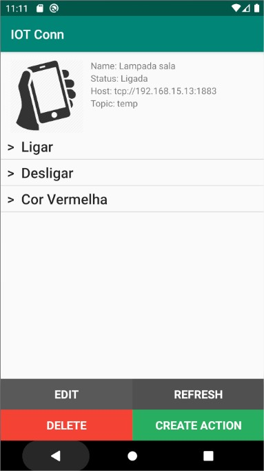

# IoT Connector
## Sobre
Aplicativo android para comunicação com dispositivos via protocolo MQTT

App desenvolvido para trabalho de conclusão de curso tendo um de seus objetivos a contribuir para a comunidade com o código fonte. Atualmente o aplicativo tem validação por usuário, dados salvos no Realtime Database e realiza publicações via MQTT utilizando a biblioteca do Eclipse Paho.

Tecnologias utilizadas:
- Conexão MQTT: Eclipse Paho
- Autenticação e Banco de dados: Google Firebase

Link para download do APK:  [Releases](https://github.com/tailoralm/IoTConn/releases/); 

## Instruções de instalação
Em breve.

## Instruções de uso
- Ao abrir o aplicativo o login deve ser realizado. Caso não tenha usuário deve clicar em registrar e registrar-se.
- Na tela principal é apresentado os dispositivos adicionados, para adicionar um deve clicar no botão de adicionar.
- Ao clicar no dispositivo é aberta a tela do mesmo, onde será possível enviar mensagens/comandos para os mesmos.
- Para adicionar um botão basta clicar em "adicionar" na tela do dispositivo.
- Para deletar um botão de comando deve dar um clique longo em cima do mesmo e uma notificação aparecerá.

### Atualização do Status
Cada dispositivo é tratado por um tópico diferente.
Quando está com a tela do dispositivo aberta o app realiza um <i>subscribe</i> no tópico "status_" + <i>tópico do dispositivo</i>, por exemplo:
* Host: localhost
* Port: 1883
* Topic: termometro

Ao abrir a tela do dispositivo o app estará <i>subscribed</i> no tópico "status_termometro" recebendo as mensagens e salvando na base de dados.

### Screenshots
Login            |  Register
:-------------------------:|:-------------------------:
</img>|</img>
Main             |  Device Screen
</img>|</img>
Create Button             |  Create Device
</img>|</img>
Delete Button             |  Delete Device
</img>|</img>
